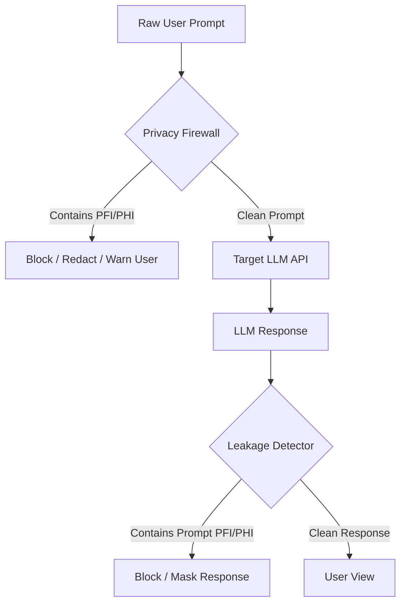

# Architecture Report: PFI and PHI Detection in LLM Prompts

**Project Repository:** [GitHub: ru-dubnium/extracting-pii-and-phi](https://github.com/ru-dubnium/extracting-pii-and-phi)  
**Author:** Kunal  
**System Architecture:** Hybrid Deterministic-Semantic Offline Extraction Engine  

---

## 1. Introduction & Threat Model

With the explosive growth of Large Language Models (LLMs) in enterprise and consumer workflows, the risk of sensitive data leakage has escalated dramatically. When users send prompts containing **Personal Financial Information (PFI)** and **Personal Health Information (PHI)** to third-party APIs, they trigger severe compliance and privacy vulnerabilities (e.g., HIPAA, PCI-DSS, GDPR). 

A robust detection engine must act as a **bidirectional privacy firewall** before prompts are transmitted and before responses are returned:



To ensure absolute security, our solution implements an **offline-first hybrid engine** combining deterministic regular expressions, local heuristics fallbacks, and local semantic LLMs.

---

## 2. Personal Health Information (PHI) Detection

Health information is highly sensitive and legally protected under HIPAA. Our engine classifies PHI into deterministic patterns and unstructured semantic contexts:

### A. Deterministic PHI Detection
* **Health Insurance IDs & SSNs:** Often follow strict formats (e.g., 2-3 letters followed by 6-10 digits, or 9-digit hyphenated patterns). These are extracted with 100% confidence using optimized regular expressions:
  ```python
  # Regex for Health Insurance and SSN-style IDs
  "HEALTH_INSURANCE_ID": r'\b[A-Z]{2,3}\d{6,10}\b|\b\d{3}-\d{2}-\d{4}\b'
  ```
* **Date of Birth (DOB):** Extracted using multi-format regex supporting ISO formats (`YYYY-MM-DD`), standard formats (`MM/DD/YYYY`), and textual formats (`January 15, 1990`).

### B. Semantic PHI Detection (Local LLM & Heuristics)
Unstructured medical records, treatment plans, and symptoms do not follow regular patterns. To extract these without leaking data to cloud endpoints, we deploy a local instance of **Llama 3.2** via Ollama:
* **Medical Conditions & Symptoms:** The LLM is prompted to dynamically identify conditions (e.g., "hypertension," "stage III oncology report") in natural language prompts.
* **Medications:** The engine extracts clinical substances (e.g., "Insulin," "Lisinopril") in continuous text.
* **Heuristics Fallback:** If the local LLM daemon is offline, the system seamlessly cascades to a dictionary-based regex engine containing critical health conditions and key medications (e.g., Metformin, Sertraline, Albuterol), ensuring zero-downtime protection.

---

## 3. Personal Financial Information (PFI) Detection (Engine Extension)

To secure financial workflows, we extend our hybrid detection model to intercept and validate Personal Financial Information (PFI):

```
                                  ┌──────────────────────────┐
                                  │   Raw Prompt / Source    │
                                  └─────────────┬────────────┘
                                                │
                       ┌────────────────────────┴────────────────────────┐
                       ▼                                                 ▼
          ┌─────────────────────────┐                       ┌─────────────────────────┐
          │  Deterministic Engine   │                       │     Semantic Engine     │
          │ (Regex + Math Luhn Check)│                       │  (Context / Intent LLM) │
          └────────────┬────────────┘                       └────────────┬────────────┘
                       │                                                 │
                       └────────────────────────┬────────────────────────┘
                                                ▼
                                   ┌─────────────────────────┐
                                   │  Span Merger & Resolver │
                                   └─────────────────────────┘
```

### A. Deterministic PFI Extraction
* **Credit Card Numbers (PANs):** Standard Visa, Mastercard, and Amex numbers matching numeric sequences of 13 to 19 digits.
* **Luhn Algorithm Validation:** Matching number patterns alone creates high false-positive rates (e.g., order IDs, product codes). The deterministic engine feeds matches into the double-and-sum Luhn algorithm. Only matches that pass the checksum are marked as active PFI.
* **Bank Routing & Account Numbers:** Routing numbers (9 digits) verified against the ABA routing transit number checksum. International Bank Account Numbers (IBANs) verified against national length and format rules.
* **Tax Identification Numbers (TIN / SSN / EIN):** Hyphenated structures matching tax records.

### B. Semantic Financial Detection
* Financial context extends beyond raw numbers. If a prompt reads: *"Explain my stock portfolio gains for account ending in 4521"* or *"Here is my monthly income from consulting: $8,500"*, standard regex fails.
* The local LLM is instructed to identify financial declarations, net worth disclosures, and salary numbers, tagging them under `FINANCIAL_CONTEXT` or `INCOME_DATA` with a contextual confidence score.

---

## 4. Resolving Overlaps & Risk Orchestration

When combining deterministic (regex) and semantic (LLM) extractors, duplicate matches are inevitable. For instance, `Metformin` might be caught by both the fallback dictionary and the LLM. 

### A. Smart Entity Merging & Conflict Resolution
Our `merge_entities` pipeline runs a highly optimized interval-tree resolution:
1. **Deduplication:** Merges identical types and values, prioritizing deterministic matches over LLM predictions.
2. **Span Overlap Resolution:** If two entities overlap in character offsets (e.g., *"123 Main St"* vs *"Main St"*):
   * The **longer character span** is kept (most specific).
   * If spans are of equal length, the match with the **higher confidence score** is preserved.
   * If confidence scores are identical, the **deterministic source** is chosen over the LLM.

### B. Multi-Tiered Risk Scoring
The engine computes an aggregate risk index to determine action items:
* **HIGH RISK:** Any presence of `MEDICAL_CONDITION`, `MEDICATION`, `HEALTH_INSURANCE_ID`, or `CREDIT_CARD_NUMBER`. Prompts are strictly blocked or redacted.
* **MEDIUM RISK:** General PII like `EMAIL`, `PHONE`, `ADDRESS`, or `DATE_OF_BIRTH`. Prompts trigger user warnings or selective masking.
* **LOW RISK:** Clean prompts with zero sensitive data detected.

---

## 5. What I Learned (Engineering & Architectural Takeaways)

Developing this enterprise-grade leakage detection pipeline provided deep insights into ML engineering, security, and offline optimization:

1. **Offline-First compliance is mandatory for privacy systems.** Sending prompts to an external cloud API to scan for PII/PHI defeats the entire purpose of privacy safeguarding. Leveraging highly compact local models like **Llama 3.2** (3B parameters) allows on-device inference with zero data leakage and negligible latency.
2. **Deterministic-Semantic Hybrid systems outperform single-strategy pipelines.** Pure regex misses unstructured contexts (e.g., descriptive medical histories). Pure LLMs fail at precise formatting, suffer from hallucination, and cannot output exact character offsets (`start` and `end` indices) required for redacting sensitive text. Combining them yields maximum precision and recall.
3. **Offset-reconciliation is a major LLM pain point.** LLMs output structured JSON list values but struggle to track their exact index inside the source document. We successfully solved this by building a post-processing offset-aligner that performs case-insensitive substring matching of LLM results in the raw text to compute accurate bounds.
4. **Validation via Golden Datasets is critical.** Having a 50-prompt validation suite with diverse test cases—including negative examples (prompts with no PII)—ensures that any tuning of regex patterns or system prompts doesn't degrade performance or increase false alarm rates.

---

## 6. Project Link & Code Structure

The entire codebase is structured for ease of CLI deployment, automated testing, and extensibility:

* **Repository Link:** [https://github.com/ru-dubnium/extracting-pii-and-phi](https://github.com/ru-dubnium/extracting-pii-and-phi)
* **Code Elements:**
  * `src/extractor.py`: Hybrid orchestrator.
  * `src/regex_extractor.py`: High-speed deterministic pattern matching.
  * `src/llm_extractor.py`: Local Ollama integration and heuristic backup lists.
  * `src/merger.py`: Conflict resolution and entity span deduplication.
  * `src/ocr.py`: Pillow and pytesseract integration for scanning document images.
  * `src/risk.py` & `src/leakage.py`: Risk classification and prompt-to-response leakage verification.
  * `tests/test_golden.py`: Standard validation tests.
