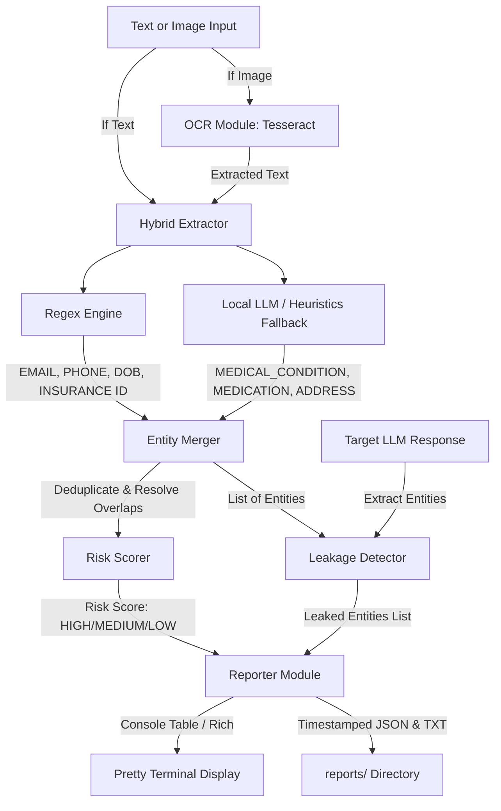

# PII/PHI Extraction System for Privacy Testing

An offline-first, hybrid PII/PHI extraction system designed to test whether target LLMs leak sensitive user information. The system leverages regular expressions for standard structured patterns and a local LLM (via Ollama) or keyword-based fallback heuristics for contextual PII/PHI. It also supports image inputs using Tesseract OCR.

---

## Architecture Flow



---

## Features
- **Hybrid Extraction Engine**:
  - **Regex**: High-speed, high-confidence extraction of pattern-based identifiers (Email, Phone, Date of Birth, Health Insurance ID).
  - **Local LLM**: Context-sensitive extraction of unstructured medical entities (Medical Conditions, Medications) and free-text Addresses using Ollama (`llama3.2`).
  - **Heuristics Fallback**: Local dictionary and specialized regex patterns that automatically activate if the Ollama daemon is offline or connection times out.
- **Image OCR Input**: Extract PII/PHI from scanned documents, forms, or contact card images using pytesseract.
- **Advanced Merger Logic**: Smart entity deduplication prioritizing regex-extracted entities and resolving overlapping text spans by preferring the longest and most specific match.
- **Risk Scoring**: Categorizes overall privacy risk (HIGH: PHI/Insurance; MEDIUM: standard contact info; LOW: no sensitive data).
- **Leakage Detection**: Compares entities in the input prompt against the target LLM response to confirm if any input PII/PHI leaked into the response.
- **Pretty Reporting**: Color-coded CLI reports powered by `rich`, with automatic saving of structured JSON and text artifacts to a `reports/` folder.
- **Golden Dataset**: Includes a robust regression suite of 50 parameterized test cases and comprehensive unit tests.

---

## Project Structure

```
pii_phi_extractor/
├── README.md               # Documentation
├── requirements.txt         # Python dependencies
├── setup.sh                 # Install scripts for Ollama, Tesseract, and Python deps
├── src/
│   ├── __init__.py          # Exports core components
│   ├── extractor.py         # Main HybridExtractor class
│   ├── regex_extractor.py   # Pattern regexes (Email, Phone, DOB, Health ID)
│   ├── llm_extractor.py     # Ollama client and local heuristic fallback
│   ├── ocr.py               # Tesseract OCR handler
│   ├── merger.py            # Deduplication and overlap resolution
│   ├── risk.py              # HIGH/MEDIUM/LOW risk scoring
│   ├── leakage.py           # Comparing input entities with output response
│   ├── reporter.py          # Pretty console tables
│   └── cli.py               # CLI entry point
├── tests/
│   ├── __init__.py
│   ├── test_extractor.py    # Unit tests (merger, risk, leakage, OCR mock)
│   ├── golden_dataset.json  # 50 prompt test cases
│   └── test_golden.py       # Parametried golden dataset validation tests
└── data/
    └── sample_images/       # Contains contact_card.png for OCR testing
```

---

## Installation & Setup

Make sure you are on a Linux system. Run `setup.sh` to install Tesseract OCR, Ollama, download the `llama3.2` model, and install Python libraries.

```bash
chmod +x setup.sh
./setup.sh
```

### Python Dependencies Manual Install
```bash
pip install -r requirements.txt
```

---

## CLI Usage Examples

### 1. Extract from Text
Analyze a raw text string for sensitive PII/PHI:
```bash
python3 src/cli.py --prompt "My email is test@example.com and I take Metformin for diabetes."
```

### 2. Extract from Image (OCR)
Perform OCR on an image and search it for PII/PHI (we programmatically created a sample at `data/sample_images/contact_card.png`):
```bash
python3 src/cli.py --image data/sample_images/contact_card.png
```

### 3. Leakage Detection (Prompt vs. Response)
Analyze an input prompt file and a target LLM response file to check if any of the prompt's sensitive data is leaked:
```bash
# Create test files
echo "My email is test@example.com and I take Metformin for diabetes." > input.txt
echo "Sure, I can help you, test@example.com. For diabetes you can take Metformin." > response.txt

# Run CLI with both files
python3 src/cli.py --input-file input.txt --output-file response.txt

# Clean up
rm input.txt response.txt
```

---

## Running the Test Suite

Run the full suite of unit tests and validation of the 50 golden dataset prompts using pytest:

```bash
python3 -m pytest tests/ -v
```
All tests run with local fallbacks, so they will succeed even if the Tesseract binary or the local Ollama service is not installed on the testing host.
